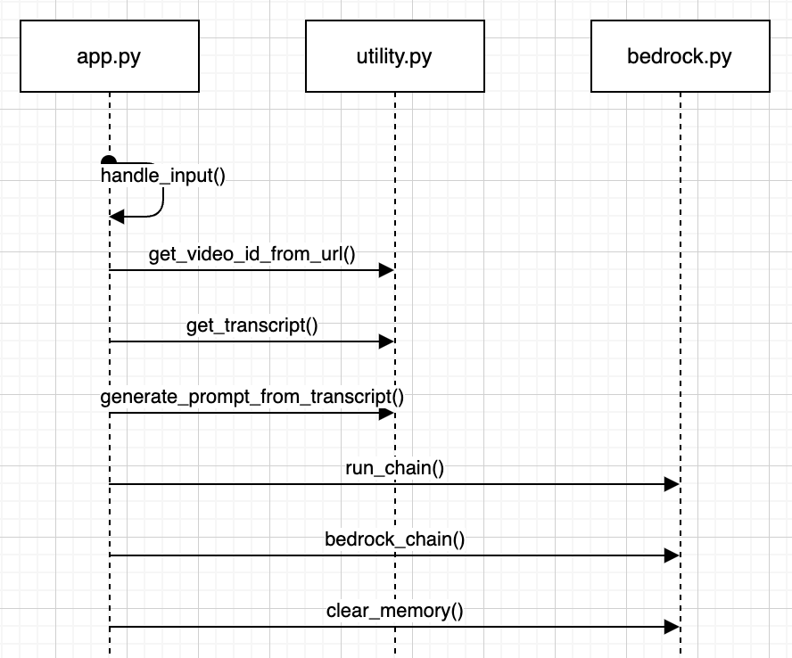

Based on the follwing UML sequence diagram, given as an XML file in draw.io, create Python function files, one for each .py file shown in the diagram, and inside the .py files, function stubs which make the respective function calls.
(hint: for a better understanding, this is the graphical view of the draw.io file which is indicated as XML below)


<mxfile host="Electron" modified="2024-07-15T11:20:21.966Z" agent="Mozilla/5.0 (Macintosh; Intel Mac OS X 10_15_7) AppleWebKit/537.36 (KHTML, like Gecko) draw.io/24.6.4 Chrome/124.0.6367.207 Electron/30.0.6 Safari/537.36" etag="aavPLeGI-V0f88FW2eqN" version="24.6.4" type="device">
  <diagram name="Page-1" id="4GUVqpLBEEVFClombRBR">
    <mxGraphModel dx="1306" dy="894" grid="1" gridSize="10" guides="1" tooltips="1" connect="1" arrows="1" fold="1" page="1" pageScale="1" pageWidth="1169" pageHeight="827" math="0" shadow="0">
      <root>
        <mxCell id="0" />
        <mxCell id="1" parent="0" />
        <mxCell id="R57TFwHWyTwA7Dr1-9iZ-1" value="app.py" style="shape=umlLifeline;perimeter=lifelinePerimeter;whiteSpace=wrap;html=1;container=1;collapsible=0;recursiveResize=0;outlineConnect=0;" vertex="1" parent="1">
          <mxGeometry x="20" y="30" width="100" height="460" as="geometry" />
        </mxCell>
        <mxCell id="R57TFwHWyTwA7Dr1-9iZ-2" value="utility.py" style="shape=umlLifeline;perimeter=lifelinePerimeter;whiteSpace=wrap;html=1;container=1;collapsible=0;recursiveResize=0;outlineConnect=0;" vertex="1" parent="1">
          <mxGeometry x="180" y="30" width="100" height="460" as="geometry" />
        </mxCell>
        <mxCell id="R57TFwHWyTwA7Dr1-9iZ-3" value="bedrock.py" style="shape=umlLifeline;perimeter=lifelinePerimeter;whiteSpace=wrap;html=1;container=1;collapsible=0;recursiveResize=0;outlineConnect=0;" vertex="1" parent="1">
          <mxGeometry x="340" y="30" width="100" height="460" as="geometry" />
        </mxCell>
        <mxCell id="R57TFwHWyTwA7Dr1-9iZ-4" value="handle_input()" style="html=1;verticalAlign=bottom;startArrow=oval;endArrow=block;startSize=8;" edge="1" parent="1" source="R57TFwHWyTwA7Dr1-9iZ-1" target="R57TFwHWyTwA7Dr1-9iZ-1">
          <mxGeometry relative="1" as="geometry">
            <mxPoint x="70" y="110" as="sourcePoint" />
            <mxPoint x="70" y="140" as="targetPoint" />
            <Array as="points">
              <mxPoint x="70" y="110" />
              <mxPoint x="100" y="110" />
              <mxPoint x="100" y="140" />
            </Array>
          </mxGeometry>
        </mxCell>
        <mxCell id="R57TFwHWyTwA7Dr1-9iZ-5" value="get_video_id_from_url()" style="html=1;verticalAlign=bottom;endArrow=block;" edge="1" parent="1" source="R57TFwHWyTwA7Dr1-9iZ-1" target="R57TFwHWyTwA7Dr1-9iZ-2">
          <mxGeometry relative="1" as="geometry">
            <mxPoint x="70" y="170" as="sourcePoint" />
            <mxPoint x="230" y="170" as="targetPoint" />
            <Array as="points">
              <mxPoint x="150" y="170" />
            </Array>
          </mxGeometry>
        </mxCell>
        <mxCell id="R57TFwHWyTwA7Dr1-9iZ-6" value="get_transcript()" style="html=1;verticalAlign=bottom;endArrow=block;" edge="1" parent="1" source="R57TFwHWyTwA7Dr1-9iZ-1" target="R57TFwHWyTwA7Dr1-9iZ-2">
          <mxGeometry relative="1" as="geometry">
            <mxPoint x="70" y="210" as="sourcePoint" />
            <mxPoint x="230" y="210" as="targetPoint" />
            <Array as="points">
              <mxPoint x="150" y="210" />
            </Array>
          </mxGeometry>
        </mxCell>
        <mxCell id="R57TFwHWyTwA7Dr1-9iZ-7" value="generate_prompt_from_transcript()" style="html=1;verticalAlign=bottom;endArrow=block;" edge="1" parent="1" source="R57TFwHWyTwA7Dr1-9iZ-1" target="R57TFwHWyTwA7Dr1-9iZ-2">
          <mxGeometry relative="1" as="geometry">
            <mxPoint x="70" y="250" as="sourcePoint" />
            <mxPoint x="230" y="250" as="targetPoint" />
            <Array as="points">
              <mxPoint x="150" y="250" />
            </Array>
          </mxGeometry>
        </mxCell>
        <mxCell id="R57TFwHWyTwA7Dr1-9iZ-8" value="run_chain()" style="html=1;verticalAlign=bottom;endArrow=block;" edge="1" parent="1" source="R57TFwHWyTwA7Dr1-9iZ-1" target="R57TFwHWyTwA7Dr1-9iZ-3">
          <mxGeometry relative="1" as="geometry">
            <mxPoint x="70" y="290" as="sourcePoint" />
            <mxPoint x="390" y="290" as="targetPoint" />
            <Array as="points">
              <mxPoint x="230" y="290" />
            </Array>
          </mxGeometry>
        </mxCell>
        <mxCell id="R57TFwHWyTwA7Dr1-9iZ-9" value="bedrock_chain()" style="html=1;verticalAlign=bottom;endArrow=block;" edge="1" parent="1" source="R57TFwHWyTwA7Dr1-9iZ-1" target="R57TFwHWyTwA7Dr1-9iZ-3">
          <mxGeometry relative="1" as="geometry">
            <mxPoint x="70" y="330" as="sourcePoint" />
            <mxPoint x="390" y="330" as="targetPoint" />
            <Array as="points">
              <mxPoint x="230" y="330" />
            </Array>
          </mxGeometry>
        </mxCell>
        <mxCell id="R57TFwHWyTwA7Dr1-9iZ-10" value="clear_memory()" style="html=1;verticalAlign=bottom;endArrow=block;" edge="1" parent="1" source="R57TFwHWyTwA7Dr1-9iZ-1" target="R57TFwHWyTwA7Dr1-9iZ-3">
          <mxGeometry relative="1" as="geometry">
            <mxPoint x="70" y="370" as="sourcePoint" />
            <mxPoint x="390" y="370" as="targetPoint" />
            <Array as="points">
              <mxPoint x="230" y="370" />
            </Array>
          </mxGeometry>
        </mxCell>
      </root>
    </mxGraphModel>
  </diagram>
</mxfile>

Based on the UML sequence diagram provided, I'll create three Python files with function stubs for the respective function calls. Here are the files:

1. app.py

```python
from utility import get_video_id_from_url, get_transcript, generate_prompt_from_transcript
from bedrock import run_chain, bedrock_chain, clear_memory

def handle_input():
    # Implementation for handling input
    pass

def main():
    handle_input()
    
    video_id = get_video_id_from_url()
    transcript = get_transcript()
    prompt = generate_prompt_from_transcript()
    
    run_chain()
    bedrock_chain()
    clear_memory()

if __name__ == "__main__":
    main()
```

2. utility.py

```python
def get_video_id_from_url():
    # Implementation for extracting video ID from URL
    pass

def get_transcript():
    # Implementation for getting transcript
    pass

def generate_prompt_from_transcript():
    # Implementation for generating prompt from transcript
    pass
```

3. bedrock.py

```python
def run_chain():
    # Implementation for running the chain
    pass

def bedrock_chain():
    # Implementation for Bedrock chain
    pass

def clear_memory():
    # Implementation for clearing memory
    pass
```

These files contain function stubs based on the sequence diagram. The `app.py` file includes the main logic and calls to functions from `utility.py` and `bedrock.py`. The `utility.py` file contains utility functions for handling video IDs, transcripts, and prompt generation. The `bedrock.py` file includes functions related to the Bedrock service.

Note that these are just stubs, and you'll need to implement the actual functionality within each function based on your specific requirements.
